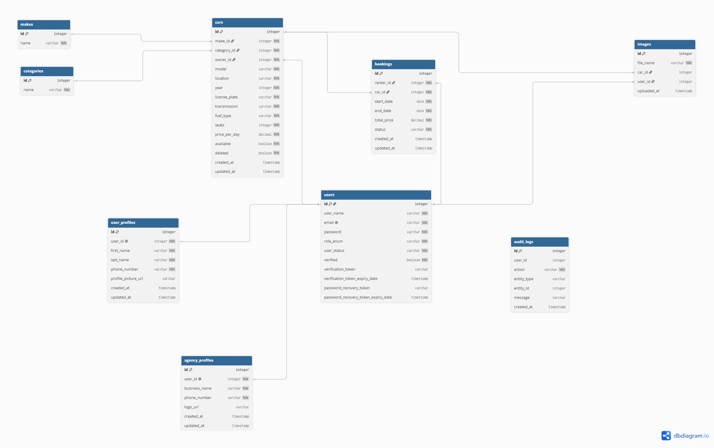

# RentRide

RentRide is a REST API for renting cars, where customers book cars, agencies list and manage them, and admins oversee the platform.

## Table of Contents

1. [Project Information](#project-information)
2. [Technologies](#technologies)
3. [Architecture](#architecture)
4. [General Approach](#general-approach)
5. [User Stories](#user-stories)
6. [ERD](#erd)
7. [Planning](#planning)
8. [API Documentation](#api-documentation)
9. [Installation](#installation)
10. [Unsolved Problems](#unsolved-problems)
11. [Major Challenges](#major-challenges)
12. [Future Improvements](#future-improvements)

---

## Project Information

### Description

RentRide is a backend REST API built with Spring Boot. It lets agencies publish cars for rent, lets customers search for cars and book them for a date range, and gives admins the tools to approve agencies and manage user accounts. Access is protected with JWT authentication and three roles: customer, agency and admin.

### Application Purpose

Renting a car usually means calling several agencies and checking availability by hand. This application puts the whole flow in one place:

- Agencies publish their cars and decide which booking requests to accept.
- Customers browse the available cars, request a booking for specific dates, and get notified when the agency answers.
- Admins keep the platform safe by approving new agencies and deactivating accounts when needed.

### Main Features

**Customers**
- Register, verify their email address, and log in
- Create and update a profile, and upload a profile picture
- Browse cars with pagination, filtered by location, category or make
- Book a car for a date range (the total price is calculated automatically)
- View their own bookings and cancel them
- Receive real-time booking notifications (Server-Sent Events)

**Agencies**
- Register, verify their email address, and wait for admin approval before they can log in
- Create and update an agency profile
- Create, update and delete car listings (deleted cars are hidden, not removed from the database)
- Upload car images (JPG or PNG)
- View the bookings made on their cars, and approve, reject or cancel them

**Admins**
- Activate and deactivate user accounts
- Approve pending agency accounts
- View all bookings, optionally filtered by status

**General**
- JWT authentication with role-based access control
- Email verification, password recovery and password change
- Booking rules: no bookings in the past, the start date must be before the end date, and approved bookings cannot overlap for the same car
- Audit log that records important actions (registration, approvals, bookings and so on)
- Consistent JSON error responses from a global exception handler
- Request rate limiting
- Database seeding for local testing
- Swagger / OpenAPI documentation

---

## Technologies

- Java 25
- Spring Boot 4.1.1
- Spring Security 7 with JWT (jjwt)
- Spring Data JPA / Hibernate 7
- PostgreSQL
- Maven
- Spring Mail (email verification and password recovery, tested with Mailtrap)
- Server-Sent Events (SSE) for real-time booking notifications
- Swagger / OpenAPI (springdoc)
- Lombok
- Bean Validation
- JUnit 5 and Mockito
- Git / GitHub

---

## Architecture

The application follows a standard layered architecture:

```
Client (Postman / Swagger / frontend)
        |
        v
  Controller layer   - HTTP endpoints, request validation, status codes
        |
        v
   Service layer     - business rules, authorization checks, audit logging
        |
        v
 Repository layer    - Spring Data JPA
        |
        v
    PostgreSQL
```

Requests and responses use DTOs (Java records), so the database entities are never exposed directly. Errors are thrown as custom exceptions in the service layer and translated into JSON responses by one global handler.

### Major Components

- **Security:** a JWT filter reads the token from the `Authorization` header, loads the user, and sets the authentication. Roles are enforced with `@PreAuthorize` on the controllers.
- **Global exception handling:** maps custom exceptions to HTTP statuses (400, 401, 403, 404, 409, 500) and returns the same JSON error body every time.
- **Agency approval:** a new agency gets the status `UNAPPROVED_AGENCY`. Spring Security treats that account as locked, so it cannot log in until an admin activates it.
- **Audit logging:** an audit service records who did what, for example registrations, approvals, bookings and car changes.
- **Notifications:** booking events are pushed to connected users over Server-Sent Events (`/notifications/stream`).
- **File storage:** car images and profile pictures are validated by their real content (not just the file name), renamed with a random UUID, and stored in the `uploads/` folder.
- **Rate limiting:** a filter limits repeated requests and returns 429 when the limit is exceeded.
- **Data seeding:** a startup component creates the admin, categories, makes and test accounts if they don't exist yet.

### Project Structure

```
src/main/java/com/ga/RentalSystem
├── config        - OpenAPI configuration, DataSeeder
├── controller    - REST controllers
├── dto
│   ├── request   - request records
│   └── response  - response records
├── enums         - Role, UserStatus, BookingStatus, FuelType, TransmissionType
├── exceptions    - custom exceptions and the global exception handler
├── model         - JPA entities (User, UserProfile, AgencyProfile, Car, Make, Category, Image, Booking, AuditLog)
├── repository    - Spring Data repositories
├── security      - JWT utilities and filter, user details, security configuration
└── service       - business logic
```

---

## General Approach

I built the project one feature at a time, and each feature was developed on its own Git branch and merged into `main` once it worked. Within a feature I always worked from the inside out: the entity and repository first, then the service with the business rules, and only then the controller. After each step I committed, so the history shows how the project grew.

The structure is deliberately simple. Controllers only receive the request and return the result, services contain all the rules, and repositories only talk to the database. Every rule that can fail throws a custom exception (not found, conflict, forbidden and so on), and a single global handler turns each one into the right HTTP status. That keeps the controllers short and the error responses consistent.

For the major features, authentication uses JWT with Spring Security. Registration creates an unverified user and sends an email with a verification link, and login is blocked until the email is verified. Agencies get one extra step: they start as `UNAPPROVED_AGENCY` and an admin has to approve them. Bookings start as `PENDING`, and the agency approves or rejects them. When approving, the service checks that no other approved booking overlaps the same dates, and the price is calculated from the number of days and the car's daily price. File uploads check the first bytes of the file to confirm it really is a JPG or PNG. Before the documentation step I did a cleanup pass so that every endpoint returns a DTO, and each endpoint returns a sensible status code (201 for creation, 204 for deletion and activation, 200 otherwise).

---

## User Stories

The user stories are grouped by role (customer, agency, admin) and system quality, and each one lists the endpoint that implements it.

[User stories](docs/user-stories.md)

---

## ERD



---

## Planning

The planning document covers the scope, the deliverables by phase with their progress, the timeline, and the way of working.

[Planning document](docs/planning.md)

---

## API Documentation

Swagger UI is available when the application is running:

- Swagger UI: `http://localhost:8080/swagger-ui/index.html`
- OpenAPI JSON: `http://localhost:8080/v3/api-docs`

To call protected endpoints from Swagger:

1. Call `POST /users/login` with a seeded account (see [Seed the database](#5-seed-the-database)).
2. Copy the token from the response.
3. Click **Authorize** at the top right, paste the token (without the word `Bearer`), and confirm.

---

## Installation

### 1. Clone the repository

```bash
git clone https://github.com/Yahya-352/project2-RentalSystem.git
cd project2-RentalSystem
```

You need **JDK 25**, **Maven** and **PostgreSQL** installed.

### 2. Configure the application

The settings are in `src/main/resources`:

| File | Purpose |
|---|---|
| `application.properties` | Chooses the active profile (`spring.profiles.active`) |
| `application-dev.properties` | Local development: SQL logging and full error details |
| `application-test.properties` | Production-style settings: no SQL logging and no stack traces in error responses |

Choose the profile in `application.properties`, or override it with the `SPRING_PROFILES_ACTIVE` environment variable.

### 3. Configure PostgreSQL

Create an empty database. The name is case-sensitive, so keep the quotes:

```sql
CREATE DATABASE "RentalSystem";
```

The application connects to `jdbc:postgresql://localhost:5432/RentalSystem`. The tables are created automatically on the first start (`spring.jpa.hibernate.ddl-auto=update`), so you don't need to run any SQL scripts. If your PostgreSQL runs on another host or port, change `spring.datasource.url` in the profile file you use.

### 4. Configure environment variables

Secrets are not stored in the repository. Set these variables before starting the application:

| Variable | Purpose |
|---|---|
| `DB_USERNAME` | Database user (defaults to `postgres`) |
| `DB_PASSWORD` | Database password |
| `JWT_SECRET` | Secret used to sign JWT tokens (use a long random string, at least 32 characters) |
| `SMTP_USERNAME` | Mail server username |
| `SMTP_PASSWORD` | Mail server password |

The mail settings point to a [Mailtrap](https://mailtrap.io) sandbox inbox. Create a free inbox there and copy its SMTP username and password. Verification and password recovery emails will appear in the Mailtrap inbox instead of being sent to real addresses.

PowerShell:

```powershell
$env:DB_PASSWORD = "your-db-password"
$env:JWT_SECRET = "a-long-random-string-of-at-least-32-characters"
$env:SMTP_USERNAME = "your-mailtrap-username"
$env:SMTP_PASSWORD = "your-mailtrap-password"
```

macOS / Linux:

```bash
export DB_PASSWORD="your-db-password"
export JWT_SECRET="a-long-random-string-of-at-least-32-characters"
export SMTP_USERNAME="your-mailtrap-username"
export SMTP_PASSWORD="your-mailtrap-password"
```

In IntelliJ IDEA, add them under **Run → Edit Configurations → Environment variables** instead.

### 5. Seed the database

Seeding runs automatically every time the application starts, and it only creates data that is missing, so restarting does not create duplicates. It creates:

- The admin account
- The car categories and makes
- One test customer and one test agency (both already verified and active)

| Role | Email | Password |
|---|---|---|
| Admin | `admin@rental.com` | `Admin123!` |
| Customer | `customer@rental.com` | `Test1234!` |
| Agency | `agency@rental.com` | `Test1234!` |

No cars are seeded. To get cars to browse and book, log in as the agency and create them with `POST /cars/create`.

These accounts are for local testing only. You can change the values with `app.admin.email`, `app.admin.password` and `app.seed.password` in the profile file.

### 6. Start the application

```bash
mvn spring-boot:run
```

To pick a profile from the command line:

```bash
mvn spring-boot:run -Dspring-boot.run.profiles=dev
```

You can also run `RentalSystemApplication` from IntelliJ IDEA. The application starts on port 8080. An `uploads/` folder is created automatically the first time you upload an image.

### 7. Access the API

The base URL is `http://localhost:8080`. Log in to get a token:

```
POST /users/login
Content-Type: application/json

{
  "email": "customer@rental.com",
  "password": "Test1234!"
}
```

Send the token from the response on every protected request:

```
Authorization: Bearer <token>
```

A new agency account has to be approved before it can log in: register it with `POST /users/register/agency`, verify its email, then log in as the admin and call `PATCH /users/{id}/activate`.

### 8. Access Swagger / OpenAPI

Open `http://localhost:8080/swagger-ui/index.html` in your browser. See [API Documentation](#api-documentation) for how to authorize requests.

### Run the tests

```bash
mvn test
```

---

## Unsolved Problems

- **Rate limiting is in memory.** The counters reset when the application restarts and are not shared between multiple instances. The client address comes from `getRemoteAddr()`, which would show the proxy's address if the application runs behind a reverse proxy.
- **Spring Security errors use the default format.** A request with a missing or invalid token is rejected by the security filter before it reaches the controllers, so the response is not the JSON error body used everywhere else.
- **The password reset link cannot be used directly.** The recovery email contains a link to `/users/reset-password?token=...`, but resetting the password is a `POST` request that takes the token and the new password in the request body. The token has to be sent from Postman or Swagger.
- **Oversized uploads return a 500 error.** Files over 5 MB are rejected, but the generic handler turns the error into a 500 response instead of a 413.
- **Some endpoints return plain text.** The verification, password and resend-email endpoints return a plain string on success, while errors are JSON.
- **Notifications are not stored.** A user who is offline when a booking event happens does not receive it later.

---

## Major Challenges

**1. Spring Security errors showed nothing useful.** A request with a missing or invalid token is rejected by a security filter before it reaches any controller, so my global exception handler never saw it and the client got Spring's default response instead of my JSON error body. I learned that errors thrown in filters are handled separately from controller errors, and I listed it as a known limitation.

**2. Rate limiting.** This was harder than I expected. The limiter is a filter, so it has the same problem as above: its errors bypass the global handler. I also had to decide where to keep the counters. I kept them in memory, which is simple but resets on restart and does not work across several instances.

**3. Consistent error responses.** Different failures need different status codes, and they are easy to mix up. I fixed one rule for each code (400 invalid input, 401 wrong credentials, 403 not allowed, 404 not found, 409 conflict with existing data) and used one global handler to return the same JSON body every time.

**4. Safe file uploads.** The file name and content type sent by the client cannot be trusted. The service checks the first bytes of the file to confirm it is a JPG or PNG, stores it under a random UUID name, and checks that the final path stays inside the upload folder.

---

## Future Improvements

- Rate limiting with Redis
- Stripe for payments
- Uploading several images in one request
- Advanced search for cars based on dates
- Docker and integration tests
- JSON responses everywhere
- Reviews and ratings
